# Golden Goose Tutoring

Golden Goose Tutoring is an idea for a private tutoring business that my wife is starting in the summer of 2024. I had the idea of creating her a sample website that coincides with the learning goals of Project 1, so she could see the potential of a strong web presence when starting a business.

For the service itself, she will be providing 1-to-1 or small group tutoring to Key Stage 2 and SEN (Special Educational Needs) children in the local area of south Manchester, UK. 

As this would be her first time going freelance, she will need an accessible, functional and attractive website to entice potential clients to schedule her services. Particular emphasis will be put on creating a clear, intuitive layout explaining what to expect from the business, prices and business times - whilst also placing emphasis on testimonials and 'word of mouth'.

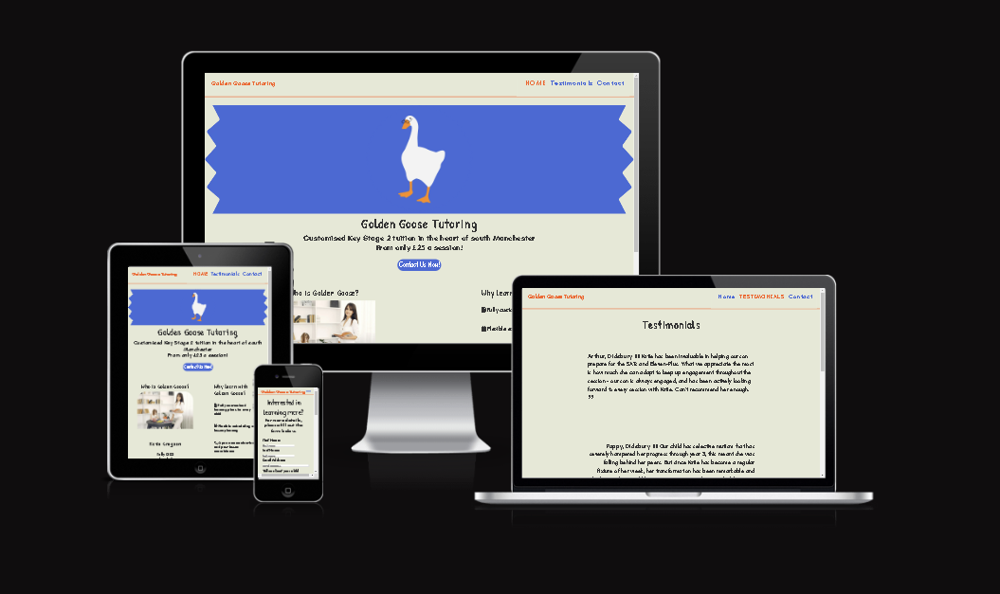

## Features

* __Navigation & Header__
    * Featured at the top left of the page as the header, the business name - Golden Goose Tutoring - and the links to the other pages displayed to the right.

        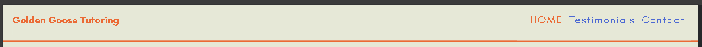

    * When displayed on mobile & screens smaller than __767px__, the burger icon to the top right of the screen opens up to display the links to the other pages - Home, Testimonials and Contact - and collapses back when clicked again using a CSS checkbox.

        
    
        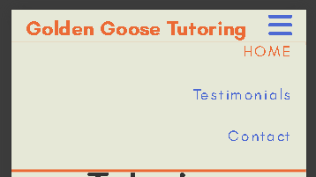

    * On screens larger than __767px__, links to other pages are displayed the top right hand side of the page to maintain accessibility.
    * The font is a plain __'Teachers'__ font colored orange against an off-white background for a clean look, and the navigation bar maintain the font & color scheme.

* __Main Home page__
    * The main home page of the site is split into 3 sections. In mobile view the sections are stacked vertically as the user scrolls, and on tablets and larger the main logo and text sits above the about and profile sections. Reactive CSS has been used to see the transformation when condensing and expanding.

        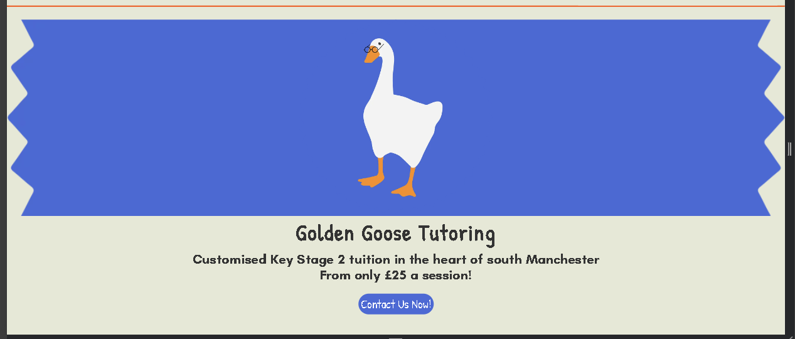

        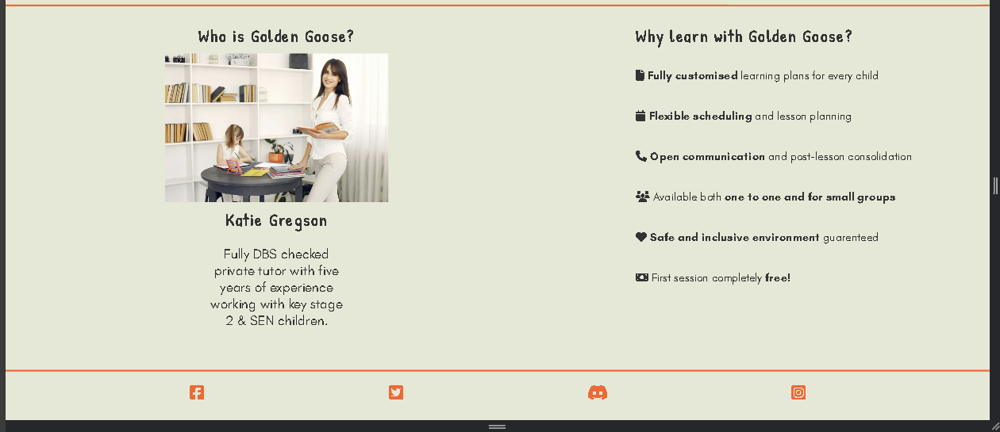

    * __Main text section__
        * The main logo is a simple image on a custom blue background with a humorous edge (see credits) that should engage potential users, and sits in the middle of the page to establish visual flow.

            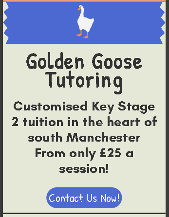

        * Beneath the main logo is the main information and function of the site - what the service is, who could be applicable, area served and price.
        * The text is in the __'Patrick Hand'__ font to in gray-black to provide clean contrast from the background and conjure a connection to schools and learning.
    * __Profile & Services section__
        * In the profile section, there is a stock profile-style image of the tutor, with qualifications and employment history summarised in a brief text block.
        * This is an important inclusion as it will establish a quasi-personal connection between the user and the service.

            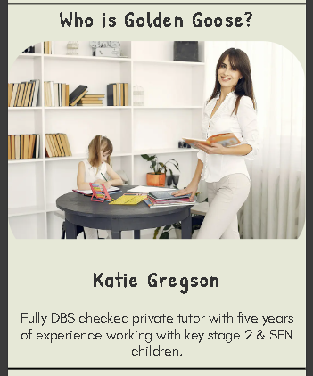

        * The services section, placed below/alongside the profile gives a succint summary in list form  of the benefits of choosing Golden Goose as a tutoring service, with favicons alongside each item to increase visual engagement.
            
            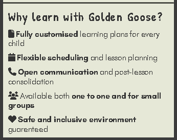

        * Certain key phrases in the services section are shown in __bold__ to draw the users eye to the key information offered by the service.

* __Testimonials page__
    * __Disclaimer - the testimonials in this section are a mix of existing clients and example text, all existing clients & children have been used with their consent and have had their names and places of residence adjusted to maintain total privacy.__
    * For a parent to choose a tutor, word of mouth is often a very important factor in the decision to use a particular service. Therefore having a standalone testimonials page ensures that this information is given emphasis, as references are very important in engagement with parents and teachers.

        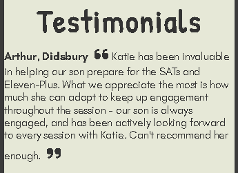

    * There are four testimonials on the page, with the contributors names in bold and favicon quotation marks at the start and end for flair, and to punctuate the text blocks.
    * At the bottom of the page is a link to Google business reviews, where encourages users to add their own reviews of the service. This link is presented in the same style as the contact button from the home page to draw the eye of the user whilst maintaining visual consistency. As the businiess would develop, more examples would be added to the page.

        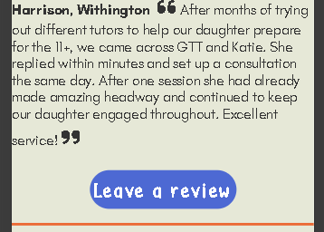

* __Contact page__
    * As with the main page, the following sections are displayed sequentially on mobiles and side-by-side on devices of 767 pixels and larger.

        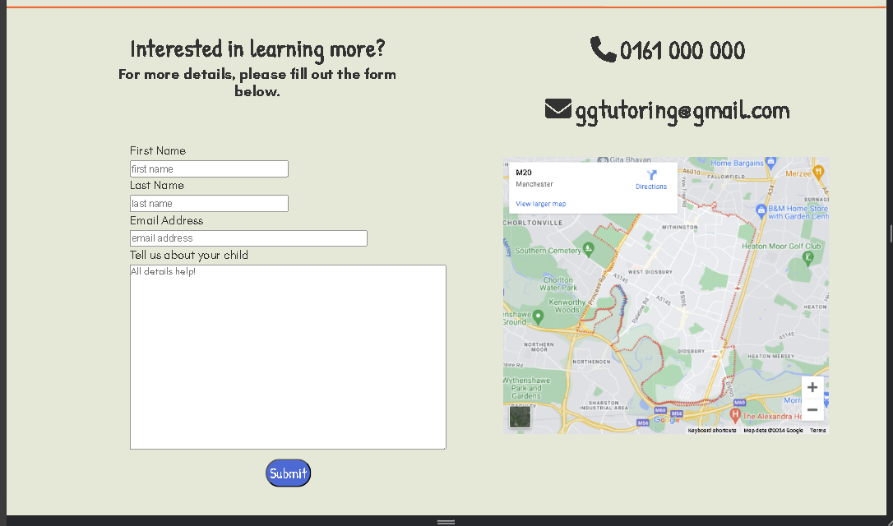

    * __Contact Form section__
        * This form is to collect details from prospective parents, in order to establish a line of communication to the tutor.
        * The inputs collected are first name, last name, email and a small blurb placed in a text box about the child in question, each input being required for successful use of the form element.

            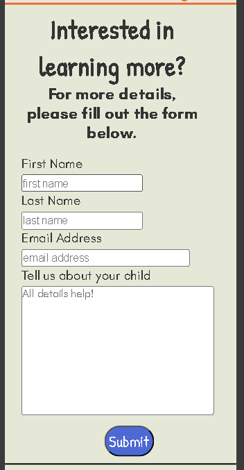

        * Allowing a textarea element in the form is key as the user/parent will likely need a larger space to enter information about their child, which is more difficult to achieve with more 'formal' elements in a contact form.
    * __Contact details section__
        * Beneath/alongside the form is a list of contact methods (with placeholder example details) displayed in a list form, and an iframe from google maps displaying the 'catchment area'.
        * This is an important feature for user to be able to contact the business with adhoc requests and gain insight into the location of services offered.

            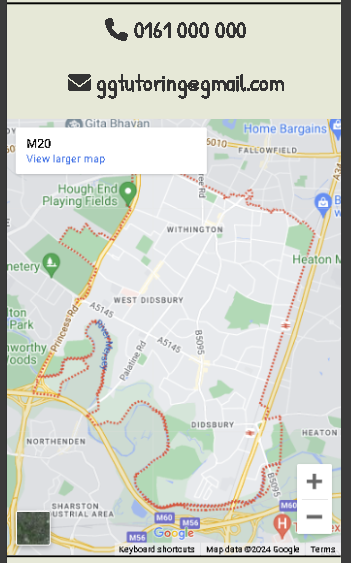

        * The list is punctuated with favicons, and presented in a larger font to provide draw the eye without the user having to search.
    * __Goodbye section__ 
        * At the bottom of the page is a message thanking users for their interest, and the logo repeated underneath to bookend the website.

* __Confirmation page__
    * Upon completion of the form, users will be redirected to a confirmation page acknowledging receipt of the data by way of centered text. Beneath the text is a return button styled identically to the submit buttons from the index page and contact page.

        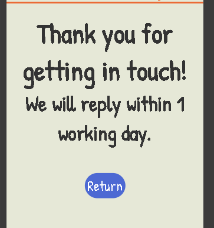

* __Footer__
    * The footer on all pages are four evenly spaced icons for social media sites; Facebook, Twitter, Discord and Instagram. These links open into new tabs and can be accessed at any time during site navigation to allow for users to explore extra resources relevant to the business.

        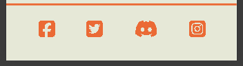

    * Each icon maintains the header color scheme of a white background with orange icons, which tops and tails the site with a consistent visual theme. In desktop size, the icons show as blue when hovered over.
    * As with the header, the footer is also responsive and the spacing and size of the icons will react to differing device sizes.

## Testing

As previously mentioned, the site is fully reactive between screens of different sizes, and was developed primarily in __mobile view__ on the smallest available screen size (Galaxy Z Fold 5) before being adapted to desktop through the use of CSS media queries. For and exhaustive list of devices used in development, see below;

* Galaxy Z Fold 5 (344x822)
* iPhone 12 Pro (390x844)
* Google Pixel 7, Samsung Galazy S20 Ultra (412x915)
* iPhone XR (414x896)
* iPhone 14 Pro Max (430x932)
* iPad Mini (768x1024)
* iPad Air (820x1180)
* iPad Pro (1024x1366)
* Desktop (1920x1080)

Throughout development of the project, I used [Google Chrome developer tools](https://developer.chrome.com/docs/devtools) to monitor the output of the website and test reponsiveness.

Additionally to Chrome, the site has been tested on the following browsers;
* Mozilla FireFox
* Microsoft Edge
* Safari

No significant differences using the site reported between each browser.

### Validators

HTML
* No errors were returned when running the site through the official [W3C validator](https://validator.w3.org/nu/?doc=https%3A%2F%2Falbaxiii.github.io%2Fgolden-goose-tutoring%2F).

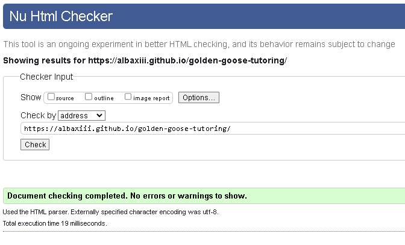

CSS
* No errors were returned when running the site through the official [Jigsaw validator](https://jigsaw.w3.org/css-validator/). 

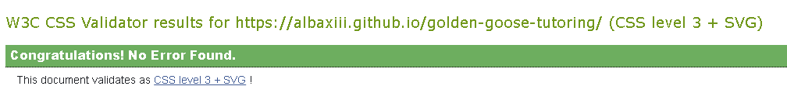

Lighthouse

* Mobile

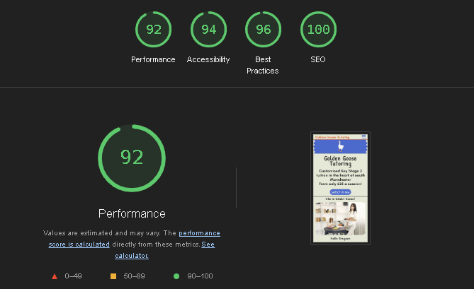

* Desktop

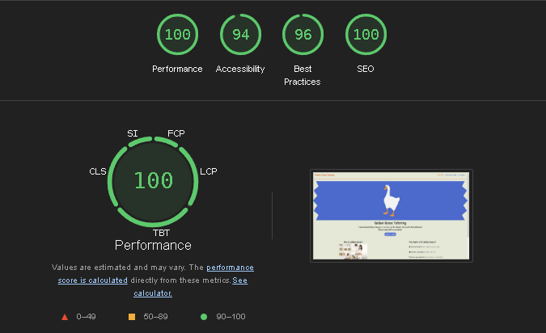

### Funtional Testing

## Bugs & Issues

### Development
* Form elements were getting crushed on transition between mobile and tablet views. I rectified this by adding a second media query on top of the initial tablet to add extra width to the div allowing the element to breathe more on transition.
* Ensuring the div elements on the index and contact page transitioned from column to side-by-side required investigation on the correct amount of padding and what CSS properties to use. Eventually I used a combination of flex, float and width adjustments to spread the divs apart, and then media quieries to make sure they displayed in line to each other.

### Unfixed Bugs
* None at time of deployment.

## Deployment

### Github Pages
* The site has been deployed on Github pages, deployed by;
    * Navigating to settings tab on master code repo page.
    * Clicking on __pages__ from the left hand menu.
    * Selecting source - deploy from branch and making sure root is selected beneath.
    * Once these settings are correct, select save.
    * The live link will show at the top of the page if deployment is successful.
    * Live page can also be accessed afterwards from the main repo, in the deployment box on the right-hand side.

The live link is found through this address - __[https://albaxiii.github.io/golden-goose-tutoring/](https://albaxiii.github.io/golden-goose-tutoring/)__.

### Cloning
* The site is also cloneable using Github;
    * From the main page repo, selecting the green code button.
    * Copying the URL to clipboard.
    * Opening a Git Bash or other command-line interface.
    * Select your desired location.
    * Copying the URL into the window, and running __git clone https://albaxiii.github.io/golden-goose-tutoring/__.

## Technologies Used
* HTML
* CSS
* Adobe Photoshop

## Credits

### Content
* Collapseable nav bar menu, reactive header and footer based on template from Love Running CI walkthrough project.

### Media
* Profile picture provided by [Pexels](https://www.pexels.com).
* Logo based on Untitled Goose Game by House House Games, adapted from a .psd file made available on this [Dropbox link](https://www.dropbox.com/scl/fi/cim3hnr1yyojm09l0fx39/gooseexploitable.psd?rlkey=bsxg828uvydp06k2ikf8rzy47&e=1&dl=0), originally found on [Reddit](https://www.reddit.com/r/untitledgoosegame/comments/exjet2/i_made_a_psd_so_that_you_can_exploit_our_favorite/). 
    * __All copyrights reserved by House House Games__
        * As a further precaution please see '[private study](https://www.gov.uk/guidance/exceptions-to-copyright#non-commercial-research-and-private-study)' section of this link.
* Icons on home, contact & footer taken from [Font Awesome](https://www.fontawesome.com).
* Favicon made from image sourced on [Reddit](https://www.reddit.com/r/untitledgoosegame/comments/i9pxtq/i_was_looking_for_a_goose_stealing_someting_png/) and converted using [Favicon.io](https://favicon.io/favicon-converter/).
* PNG files converted to WEBP through [CloudConvert](https://cloudconvert.com/png-to-webp).
* Iframe embedded from [Google Maps](https://www.google.com/maps).
* Responsive screenshot from [amiresponsive?](https://ui.dev/amiresponsive?url=https://albaxiii.github.io/golden-goose-tutoring/).

### Personal
* Many thanks to the client for the idea and creative input.
* My mentor Dick Vlaanderen for his advice and constructive input throughout.

